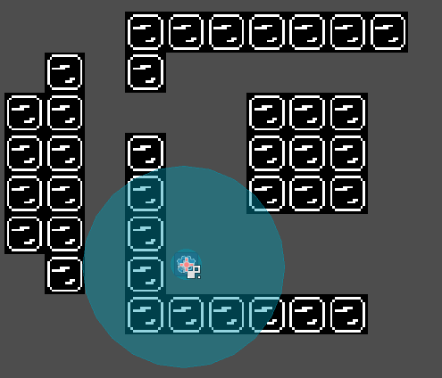
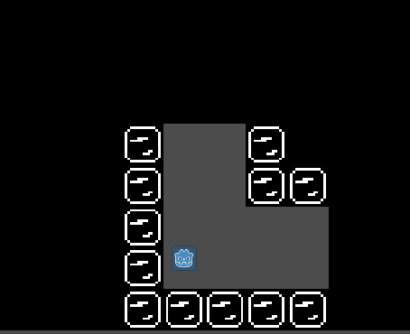
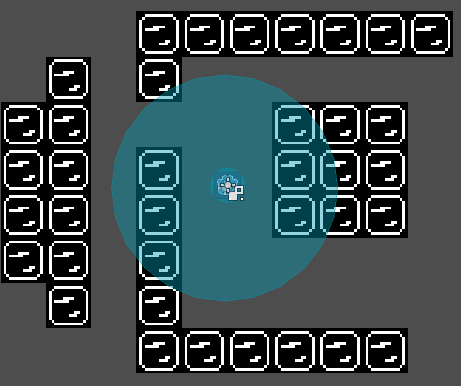
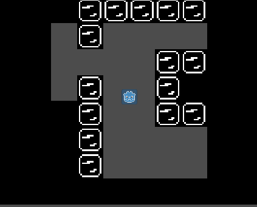

# ObfuscatedTileMap
An Addon for Godot, that uses a special way of handling visibility on tilemaps.  
Visibility ranges (Area2D) can be added to players or static objects. Within those ranges, only interconnected tiles will be shown. Enclosed areas or areas behind walls will be hidden. Somehow it works a bit like global illumination, where your visibility spreads, maybe even around corners, until it gets blocked.  

## Project Status
This project is in a very early stage and not very user friendly. Some TODOs are mentioned in the code, setup variables are still hidden in the code and other issues are even noticable in the example images above.

## Installation
You'll need the Godot Engine to do this.  

To use ObfuscatedTileMap as an Addon:
- Copy the "addons" folder to your project.
- Enable ObfuscatedTileMap addon on "Project Settings".
- Instance a ObfuscatedTileMap node to your scene.

See [the official documentation](https://docs.godotengine.org/en/stable/tutorials/plugins/editor/installing_plugins.html) for further information.
